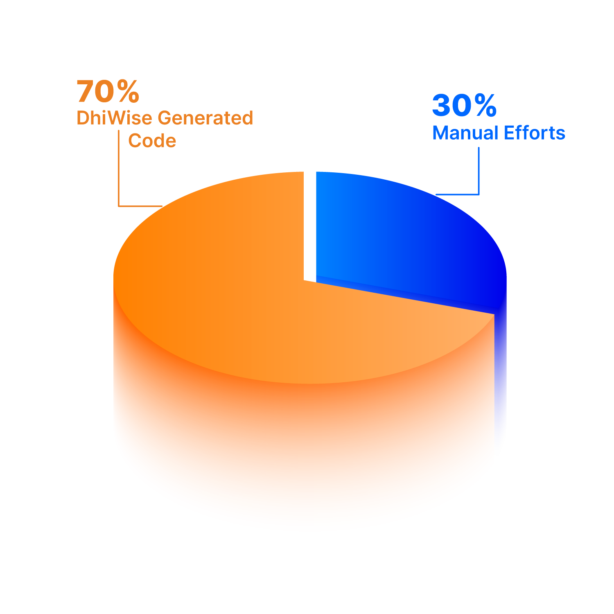
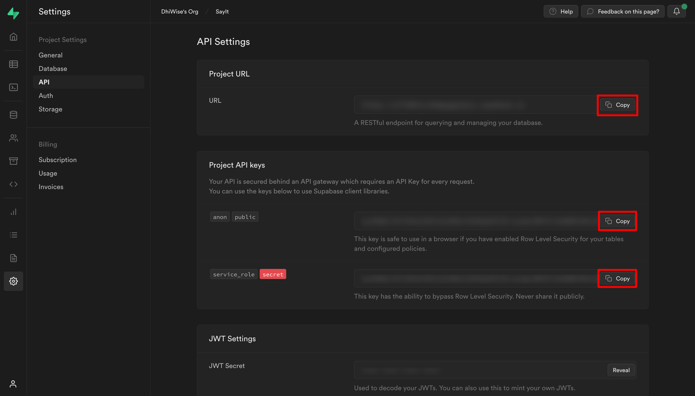

# 🗳SayIt

## **Open Source**, **Self-hosted** **and** **Free**

SayIt helps you gather feature requests and feedback, organizes them based on their priority, and helps you plan your roadmap. Also, it engages everyone with the new updates when a requested feature is updated.

**Admin panel overview**


**User panel overview**


<br/>

# ✨ Features


✅ ️Collect Customer Feedback 

✅ Product feature voting board 

✅ Comment on posts to get more insights 

✅ See all votes from a specific user on their profile 

✅ Track project status and keep your team on the same page 

✅ Get track of Status updates, Post creations, New comments, and Post ownerships by notifications 

✅ Manage posts

✅ Send Invite to the user over mail

✅ User signup

✅ Role-based access

✅ Manage tags for posts

⭕ Manage profile

⭕ Change board visibility to private

⭕ Manage Company

⭕ Publish on Product Hunt


<br/>

# 🔨 Build with


<a href="https://www.dhiwise.com" target="_blank"></a>

<a href="https://supabase.com" target="_blank"></a>




> ℹ️ **INFO**
You can differentiate the manual code from DhiWise-generated code by referring to the comments made in the code.

<br/>

# 💾 Database


For this project, Supabase is used for data storage. Once you log in to Supabase, you will be asked to create a project.

<br/>

# 📖 Prerequisites

## Step 1: Create a project in Supabase.

Login to your Supabase account and create an empty project in Supabase

Go to `Supabase -> Projects -> New project`

Give your project a proper name, set a password to secure your project, and click `Create new project`.

## Step 2: Email configuration in Supabase project

Go to `Project dashboard -> Authentication -> Providers` and enable the **Email**
option to authenticate your application using Email.

Now, go to `Project dashboard -> Authentication -> Email Templates`.

Add the following query for `Confirm signup` email:

```html
<h2>Confirm your signup</h2>

<p>Thank you for joining SayIt. We’d like to confirm that your account was created successfully.</p>
<p>To get you started, Please click on link to <a href="{{ .ConfirmationURL }}login">Confirm your mail</a></p>

<p>Best,</p>
<p>The SayIt team</p>
```

Add the following query for `Invite user` email:

```html
<h2>Invitation to SayIt Board</h2>

<p>You have been invited to join SayIt team. You can use it to raise feature requests, give feedback and get help.</p>
<p> Click <a href="{{ .ConfirmationURL }}signup">here</a> to accept the invite </p>

<p>Hope you will find SayIt useful!</p>

<p>Best,</p>
<p>The SayIt team</p>
```

## Step 3: Create a storage bucket

Go to `Project dashboard → Storage`; click on `📝 New bucket`.

Provide **bucket name** and set it **public**.

Now go to `Project dashboard → SQL Editor -> + New query` and RUN the following query to create policy.

```sql
create policy "Allow upload on <BUCKET_NAME>"
on storage.objects for insert
with check ( bucket_id = '<BUCKET_NAME>' );
```

> 📄 **Note:** Replace **<BUCKET_NAME>** with the name of your storage bucket.

## Step 4: Create tables and create public users

### Create tables:

Go to `Project dashboard -> SQL Editor -> + New query`.

And get the query from [here](https://github.com/DhiWise/SayIt/blob/main/queries-and-functions.md#create-tables) and paste it. 

Now, click `RUN`. 

This will create tables in your project.

To view the created tables go to; `Project dashboard -> Table Editor`.

### **Create public users:**

This function duplicates data from the Supabase `auth.users` table to the `public.profiles` table.

Go to `Project dashboard -> SQL Editor -> + New query`.

And get the query from [here](https://github.com/DhiWise/SayIt/blob/main/queries-and-functions.md#create-public-users) and paste it. 

After the function is created, run the following query in `Project dashboard -> SQL Editor -> + New query` to create a Trigger from the function.

```sql
create trigger on_create_public_user
  after update on auth.users
  for each row execute procedure public.create_public_user();
```

> 📄 **Note**
> Once the tables are created, go to `Project dashboard → Authentication → Users` and click on `+ Invite` and provide the email ID of the admin user. Once the admin accepts the invite, he will be redirected to the signup page, where admin needs to provide his Name, email and password. 


An admin user entry will be created in `public.profiles` table change the type of that admin user to **1**.

> ℹ️ **Info**
> In the profiles table, field type has below values <br/>
> **1** : Admin <br/>
> **2** : User<br/>


## Step 5: Functions and Triggers

Now, once the tables are created, **RUN** the following Functions.

Go to `Project dashboard -> SQL Editor -> + New query`.

Copy and paste the function query from here for the specific function. 

Then, click `RUN`. 

This will create a function. You can view this function from `Project dashboard → Database → Functions`.

### Functions:

> ⚠️ **Caution**
> Do not change the function names

> ℹ️ **Info**
> Function which requires arguments to be passed along will automatically take arguments after you run the query.

> 📄 **Note**
> Follow the same steps for all the below functions.

### 1️⃣ Post list with filters:

This function is used to fetch posts of users along with user activity filters (posts, votes, comments). Here we need to pass user ID and activity filters as requested, and according to the request, it will return a filtered post list. 

Get the function query from [here](https://github.com/DhiWise/sayIt/blob/main/queries-and-functions.md#1%EF%B8%8F%E2%83%A3-post-list-with-filters).

### 2️⃣ User list with sorting:

This function is used to sort users according to the activity (LAST_ACTIVITY, TOP_POSTERS, TOP_VOTERS). Here we need to pass the sorting activity, which will return the sorted user list.

Get the function query from [here](https://github.com/DhiWise/sayIt/blob/main/queries-and-functions.md#2%EF%B8%8F%E2%83%A3-user-list-with-sorting).

### 3️⃣ Post list:

This function filters posts of the logged-in users along with board and status filters(TRENDING, TOP, NEW). Here we need to pass user_id, board_id, and status as request, which will return a filtered post list.

Get the function query from [here](https://github.com/DhiWise/sayIt/blob/main/queries-and-functions.md#3%EF%B8%8F%E2%83%A3-post-list).

### 4️⃣ Get board list with post counts

This function returns the board list with the count of posts on the board.

Get the function query from [here](https://github.com/DhiWise/sayIt/blob/main/queries-and-functions.md#4%EF%B8%8F%E2%83%A3-get-board-list-with-post-counts).

### Triggers:

### 5️⃣ **Insert into Notification table on new Upvotes:**

This function Inserts a record to the `notifications` table when a new upvote is created in `upvotes` table.

Get the function query from [here](https://github.com/DhiWise/sayIt/blob/main/queries-and-functions.md#5%EF%B8%8F%E2%83%A3-insert-into-notification-table-on-new-upvotes).

After the function is created, run the following query in `Project dashboard -> SQL Editor -> + New query` to create a Trigger from the function.

```sql
create trigger on_new_upvote
  after insert on public.upvotes
  for each row execute procedure public.new_upvote();
```

### 6️⃣ **Insert into Notification table on new Comments:**

This function inserts record to the `notifications` table when a new comment is posted in `comments` table.

Get the function query from [here](https://github.com/DhiWise/sayIt/blob/main/queries-and-functions.md#6%EF%B8%8F%E2%83%A3-insert-into-notification-table-on-new-comments).

After the function is created, run the following query in `Project dashboard -> SQL Editor -> + New query` to create a Trigger from the function.

```sql
create trigger on_new_comment
  after insert on public.comments
  for each row execute procedure public.new_comment();
```

### 7️⃣ **Insert into Notification table on new Posts:**

This function inserts a record to the `notifications` table when a new post is created in `posts` table.

Get the function query from [here](https://github.com/DhiWise/sayIt/blob/main/queries-and-functions.md#7%EF%B8%8F%E2%83%A3-insert-into-notification-table-on-new-posts).

After the function is created, run the following query in `Project dashboard -> SQL Editor -> + New query` to create a Trigger from the function.

```sql
create trigger on_new_post
  after insert on public.posts
  for each row execute procedure public.new_post();
```

### 8️⃣ **Insert into Notification table on Status updates:**

This function inserts a record to the `notifications` table when the status of a post is changed, or ownership is assigned to a post from `posts` table.

Get the function query from [here](https://github.com/DhiWise/sayIt/blob/main/queries-and-functions.md#8%EF%B8%8F%E2%83%A3-insert-into-notification-table-on-status-updates).

After the function is created, run the following query in `Project dashboard -> SQL Editor -> + New query` to create a Trigger from the function.

```sql
create trigger on_status_updates
  after update on public.posts
  for each row execute procedure public.status_updates();
```

### 9️⃣ Insert in Upvotes table on New posts:

This function inserts record on the `upvotes` table when the user creates a new post.

Get the function query from [here](https://github.com/DhiWise/sayIt/blob/main/queries-and-functions.md#9%EF%B8%8F%E2%83%A3-insert-in-upvotes-table-on-new-posts).

After the function is created, run the following query in `Project dashboard -> SQL Editor -> + New query` to create a Trigger from the function.

```sql
create trigger add_user_to_upvotes
  after insert on posts
  for each row execute procedure public.add_in_upvotes();
```
<br/>

# **🖥️ Local development**


Follow these simple steps to set up your project locally.

### Step 1: Get URL and API Key

Go to `Supabase -> Project dashboard → Settings → Project Settings → API`.

Under **Project URL**, you will find the `URL` as your **<SUPABASE_PROJECT_URL>**.

Under the **Project API keys** section, you will find the `anon` `public`  as your **<PROJECT_API_KEY>**  and `service_role` `secret` as your **<PROJECT_SERVICE_ROLE_KEY>**.



### Step 2: Clone the repo

```bash
git clone https://github.com/DhiWise/SayIt.git
```

### Step 3: Install NPM packages

```bash
npm i
```

**Packages used:**

📦 [moment](https://www.npmjs.com/package/moment) 🔗

📦 [lodash](https://www.npmjs.com/package/lodash) 🔗

📦 [react-infinite-scroll-component](https://www.npmjs.com/package/react-infinite-scroll-component) [🔗](https://www.npmjs.com/package/react-infinite-scroll-component)

📦 [@reduxjs/toolkit](https://www.npmjs.com/package/@reduxjs/toolkit) 🔗

📦 [react-redux](https://www.npmjs.com/package/react-redux) 🔗

📦 [redux-persist](https://www.npmjs.com/package/redux-persist) 🔗

📦 [react-modal](https://www.npmjs.com/package/react-modal) 🔗

📦 [react-tooltip](https://www.npmjs.com/package/react-tooltip) 🔗

### Step 4: Create a `.env`  file

Create a `.env` file in the project folder and replace the **<PROJECT_API_KEY>** with `anon` `public` and **<SUPABASE_PROJECT_URL>** with `URL`. Also, replace **<PROJECT_SERVICE_ROLE_KEY>** with `service_role` `secret` we got from <a href="https://github.com/DhiWise/sayIt#step-1-get-url-and-api-key">Step 1</a> 🔗. 
And add replace the **<BUCKET_NAME>**, which we got from <a href="#step-3-create-a-storage-bucket">Step3</a> 🔗. 

```js
REACT_APP_COMMEN_URL = <SUPABASE_PROJECT_URL>/
REACT_APP_APIKEY = <PROJECT_API_KEY>
REACT_APP_AUTHORIZATION = <PROJECT_API_KEY>
REACT_APP_FILE_URL= <SUPABASE_PROJECT_URL>/storage/v1/object/<BUCKET_NAME>/profile/
REACT_APP_COMMENT_URL = <SUPABASE_PROJECT_URL>/storage/v1/object/<BUCKET_NAME>/comment/
REACT_APP_SERVICE_ROLE_KEY = <PROJECT_SERVICE_ROLE_KEY>
```

To start a local copy of the app on port `3000`:

```bash
npm start
```

<br/>

# 👁️ Live Preview

Click the below link to go check the live preview of the application.

https://say-it-eta.vercel.app/

Use the below credentials for login:

**Username**: `admin@sayit.com`

**Password**: `Admin123#`

<br/>

# 🤝 **Contributing**


If you don't have git on your machine, [install it](https://docs.github.com/en/get-started/quickstart/set-up-git).

1. Fork the Project
2. Create your Feature Branch (`git checkout -b your-branch-name`)
3. Commit your Changes (`git commit -m 'commit-message'`)
4. Push to the Branch (`git push origin your-branch-name`)
5. Open a Pull Request

<br/>

# ⚖️ **License**

## MIT License

Copyright©️ 2022 DhiWise

Permission is hereby granted, free of charge, to any person obtaining a copy of this software and associated documentation files (the "Software") to deal in the Software without restriction, including without limitation the rights to use, copy, modify, merge, publish, distribute, sublicense, and/or sell copies of the Software, and to permit persons to whom the Software is furnished to do so, subject to the following conditions:

The above copyright notice and this permission notice shall be included in all copies or substantial portions of the Software.

THE SOFTWARE IS PROVIDED "AS IS" WITHOUT WARRANTY OF ANY KIND, EXPRESS OR IMPLIED, INCLUDING BUT NOT LIMITED TO THE WARRANTIES OF MERCHANTABILITY, FITNESS FOR A PARTICULAR PURPOSE AND NON-INFRINGEMENT. IN NO EVENT SHALL THE AUTHORS OR COPYRIGHT HOLDERS BE LIABLE FOR ANY CLAIM, DAMAGES OR OTHER LIABILITY, WHETHER IN AN ACTION OF CONTRACT, TORT OR OTHERWISE, ARISING FROM, OUT OF OR IN CONNECTION WITH THE SOFTWARE OR THE USE OR OTHER DEALINGS IN THE SOFTWARE.

<br/>

# 💬 **Community**

<a href="https://twitter.com/dhiwise" target="_blank"></a> &nbsp;&nbsp;&nbsp;&nbsp;
<a href="https://discord.com/invite/hTuNauNjyJ" target="_blank"></a> &nbsp;&nbsp;&nbsp;&nbsp;
<a href="https://www.youtube.com/@DhiWise" target="_blank"></a> &nbsp;&nbsp;&nbsp;&nbsp;
